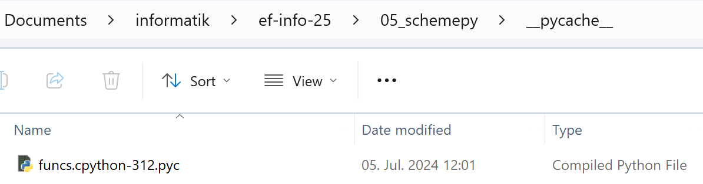

# 1 Basis

Wir schreiben unsere eigene Programmiersprache in Python. Dazu bestimmen wir zuerst wie unsere Sprache aussehen soll.

## 1.1 Syntax

Unsere Sprache lehnt sich vom Aussehen her an eine der ältesten Programmiersprachen an, welche immer noch aktiv verwendet wird: LISP.

Jede Operation in unserer Sprache wird dabei in Klammern geschrieben, mit dem Namen der Operation als erstes, gefolgt von den Argumenten. Als Trennzeichen braucht es kein Komma sondern ein einfaches Leerzeichen genügt.

Beispiel:

```lisp
(+ 1 3)
```

Operationen können beliebig verschachtelt werden:

```lisp
(+ 1 (* (- 7 2 ) 4))
```

Die Syntax ist im Vergleich zu Python nicht sehr leserlich, aber sehr einfach, und dadurch gut geeignet für Experimente.

## 1.2 Interne Darstellung eines Programms

Ein Programm wird normalerweise in einer Textdatei abgespeichert, auch Source-Code genannt. Wir können den Inhalt der Datei als String einlesen. Dieser String wird dann in die _interne Darstellung_ übersetzt. Da unsere Syntax sehr einfach ist, entspricht die interne Darstellung fast exakt dem ursprünglichen Source-Code. Wir verwenden dazu Listen, Strings und Zahlen (`int` und `float`).

_Beispiel:_

Source-Code:

```lisp
(+ (- 5 4) (* (- 7 2 ) 4))
```

Interne Darstellung in Python:

```py
['+', ['-', 5, 4], ['*', ['-', 7, 2], 4]]
```

Die interne Darstellung kann man auch als "Baum" darstellen. (Nun ja, irgendwie wachsen die Äste gegen unten ...)

```py
    ['+',   …   ,    …]
            🡓        🡓
    ['-', 5, 4]    ['*', …, 4]
                         🡓
                       ['-', 7, 2]
```

Wegen dieser Baum-ähnlichen Struktur wird die _interne Darstellung_ oft auch _Syntax Tree_ genannt.

## 1.3 Phasen der Ausführung

Um vom Source-Code zu einem ausgeführten Programm zu gelangen sind (mindestens) drei Schritte nötig. Diese Schritte werden im Informatikjargon _Phasen_ genannt.

### 1.3.1 Tokenize-Phase

In der ersten Phase wird der (lange) String mit dem Source-Code in Teile aufgetrennt, welche logisch zusammengehören. Zum Beispiel gehören bei `2.18` alle vier Zeichen zur gleichen Zahl. Aus dem String `2 18` werden jedoch zwei Tokens: `2` und `18`. Die logischen Einzelteile werden _Tokens_ genannt. Und darum heisst diese erste Phase auch _tokenize_.

Der Tokenizer-Code ist Dank eines Tricks sehr kurz:

```py
def tokenize(program):
    return program.replace("(", " ( ").replace(")", " ) ").split()
```

### 1.3.2 Parse-Phase

In der zweiten Phase wird die Liste mit Tokens in die interne Darstellung umgewandelt. Die Phase wird `parse` genannt, und besteht bei uns aus zwei Teilen:

Einerseits wird mit Listen die Struktur des Programms wiedergeben. Dies geschieht im ersten Teil der `parse`-Funktion:

```py
def parse(tokens):
    token = tokens.pop(0)
    if token == '(':
        lst = []
        while tokens[0] != ')':
            lst.append(parse(tokens))
        tokens.pop(0)
        return lst
    else:
        if token[0] in "0123456789-" and token != "-":
            if "." in token:
                return float(token)
            else:
                return int(token)
        else:
            return token
```

Der Code dazu ist zwar kurz, aber etwas schwer verständlich. Wir vertrauen einfach mal darauf, dass er funktioniert.

Andererseits benutzten wir die Python-Funktionen `int` und `float`, um im zweiten Teil der `parse`-Funktion Strings, die Zahlen enthalten, auch in Zahlen (`int` oder `float`) umzuwandeln.

Bei Sprachen mit einer schönen Syntax ist die `parse`-Phase sehr komplex, und war lange ein zentrales Problem in der Informatikforschung. Zum Beispiel musste bei Python 3.10 der komplett `parse`-Code ersetzt werden, um die neue `match`-`case`-Syntax einführen zu können.

### 1.3.3 Evaluate-Phase

In der dritten und letzten Phase wird die interne Darstellung des Programms ausgewertet (engl. _evaluate_).

Die Auswertung geschieht rekursiv.

Was passiert zum Beispiel wenn die folgende Rechnung ausgeführt werden soll?

```lisp
(+ (- 5 4) (* (- 7 2 ) 4))
```

In den ersten zwei Phasen wird der Code in die interne Darstellung übersetzt:

```py
['+', ['-', 5, 4], ['*', ['-', 7, 2], 4]]
```

Jetzt können wir schrittweise den Code ausführen. Zur besseren Übersicht verwenden wir hier die Baum-ähnliche Darstellung:

1. Äusserste Liste mit der Addition evaluieren:

```py
    ['+',   …   ,    …]           # Muss zuerst Argumente evaluieren
            🡓        🡓
    ['-', 5, 4]    ['*', …, 4]
                         🡓
                       ['-', 7, 2]
```

2. Erstes Argument der Addition (`['-', 5, 4]`) evaluieren:

```py
    ['+',   …   ,    …]
            🡓        🡓
            1      ['*', …, 4]
                         🡓
                       ['-', 7, 2]
```

3. Zweites Argument der Addition (`['*', ['-', 7, 2], 4]`) evaluieren:

```py
    ['+',   1   ,    …]
                     🡓
                   ['*', …, 4]    # Muss zuerst Argumente evaluieren
                         🡓
                       ['-', 7, 2]
```

4. Erstes Argument der Multiplikation (`['-', 7, 2]`) evaluieren:

```py
    ['+',   1   ,    …]
                     🡓
                   ['*', …, 4]
                         🡓
                         5
```

5. Jetzt kann man die Multiplikation `['*', 5, 4]` evaluieren:

```py
    ['+',   1   ,    …]
                     🡓
                     20
```

6. Und erst jetzt die äusserste Addition `['+', 1, 20]` evaluieren:

```py
    21
```

### 1.3.4 Weitere Phasen

Unsere Programmiersprache ist vereinfacht, und die interne Darstellung wird direkt evaluiert. In der allerersten Versionen von LISP wurde dies auch genau so gemacht. Relativ schnell hat man einen zusätzlichen Zwischenschritt eingeführt, welcher auch heute bei allen modernen Programmiersprachen gemacht wird. Der Code wird dabei in eine Serie von einfachen Befehlen umgewandelt, den sogenannten Bytecode. Diese Befehle erinnern an die Befehle, welche ein Prozessor direkt ausführen kann. Im gegensatz zu den Befehlen des Prozessors, auch Maschinenbefehle genannt, ist der Bytecode vereinfacht, und kommt ohne die ganzen technischen Details der historisch gewachsenen Maschinenbefehle aus.

Diese vereinfachten Befehle, also der Byte-Code, wird dann von einem Programm ausgeführt. Dieses Programm simuliert dann quasi einen vereinfachten Prozessor für die vereinfachten Befehle, und wird darum Virtuelle Maschine (kurz VM) genannt.

Den Byte-Code einer Funktion kann man in Python anschauen:

```python
>>> def f(a, b):
...     x = a * b
...     return x + x
...
>>> f.__code__.co_code
b'\x97\x00|\x00|\x01z\x05\x00\x00}\x02|\x02|\x02z\x00\x00\x00S\x00'
>>> len(f.__code__.co_code)
22
```

Diese 22 Bytes des Codes der Funktion `f` ergeben beim Betrachten keinen Sinn. Mit dem Modul `dis` (engl. `disassembly`: auseinandernehmen) können wir aber anzeigen, was mit diesen Bytes gemeint ist:

```py
>>> import dis
>>> dis.dis(f.__code__)
  1           0 RESUME                   0

  2           2 LOAD_FAST                0 (a)
              4 LOAD_FAST                1 (b)
              6 BINARY_OP                5 (*)
             10 STORE_FAST               2 (x)

  3          12 LOAD_FAST                2 (x)
             14 LOAD_FAST                2 (x)
             16 BINARY_OP                0 (+)
             20 RETURN_VALUE
```

Wir sehen, dass die Zeile `x = a * b` in vier Befehle umgewandelt wird. Zuerst werden die beiden Variablen `a` und `b` geladen, dann multipliziert (`BINARY_OP`) und zuletzt wieder unter dem Namen `x` abgespeichert.

Um diesen Byte-Code nicht jedes mal wieder neu zu generieren zu müssen, speichert Python diesen Byte-Code in Dateien mit der Dateiendung `.pyc` in Ordnern mit dem Name `__pycache__` ab. Solange die Datei mit dem ursprünglichen Python-Code nicht verändert wurde, verwendet Python den bereits existierenden Byte-Code.



Je nach Programmiersprache merkt der:ie Benutzer:in mehr oder weniger von diesem Byte-Code. In Python können wir den Source-Code direkt ausführen, und sehen nur anhand der Dateien im Ordner `__pycache__`, dass Byte-Code generiert wurde.

In JS ist dieser Zwischenschritt völlig unsichtbar, und wir sehen den Byte-Code nirgendwo. Aber die Wahrscheinlichkeit ist gross, dass der Browser den generierten Byte-Code irgendwo in einer Datei abspeichert, um ihn später wieder zu verwenden.

In Sprachen wie Java oder C# generieren wir explizit in einem ersten Schritt aus unserem Source-Code die Dateien mit Byte-Code. Diese Dateien könne wir später mit dem Programm "Virtuelle Maschine" ausführen.

Wieder anders funktionieren Sprachen wie C oder Rust. Hier generieren wir aus dem Source-Code Maschinen-Code, welcher unsere Prozessoren direkt ausführen kann, ganz ohne ein weiteres Programm. Aber auch diese Sprachen generieren zuerst intern Byte-Code, welcher dann im letzten Schritt in den Maschinen-Code des gewünschten Prozessors umwandelt. Die zwei populärsten Prozessorarten sind aktuell `x86_64`, welche oft in unseren Laptops zu finden sind. Die zweite sehr populäre Prozessorart heisst `ARM`, welche in praktisch allen Smartphones und Tablets zur Anwendung kommt. Daneben gibt es noch dutzende, wenn nicht hunderte, weiterer Prozessorarten, welche in verschiedenen Gebieten oder in der Vergangenheit zum Einsatz kamen.
