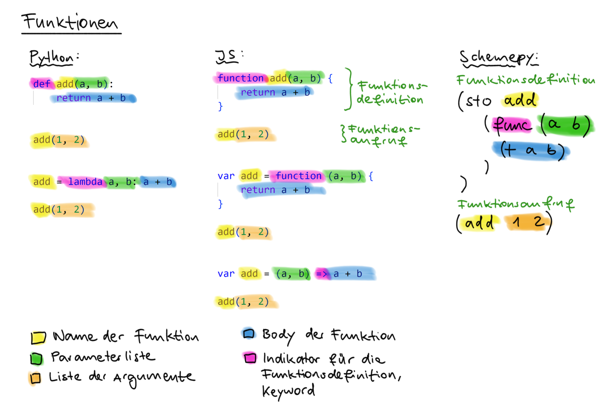

# 3 Programmiersprache

## 3.1 Funktionen, erste Version

Jetzt wollen wir unseren "Rechner" zu einem programmierbaren Rechner erweitern. Wir wollen also eigene Funktionen in unserer eigenen Sprache schreiben, welche wir danach aufrufen können. In der ersten Version werden unsere Funktionen noch nicht ganz so funktionieren, wie wir das von den bekannten Programmiersprachen her gewohnt sind.

Bevor wir loslegen können, müssen wir uns Gedanken zur Syntax machen. Mit `sto` haben wir bereits einen Weg gefunden, um etwas unter einem Namen abzuspeichern. Wir brauchen also zusätzlich noch einen Weg, wie wir eine Funktion mit ihren Parametern schreiben wollen. Dazu betrachten wir zuerst die Definition und das Ausführen von Funktionen in Python, um uns danach für unsere eigene Syntax zu entscheiden.



Als Schlüsselwort verwenden wir `func`, gefolgt von der Liste mit den Parametern und zuletzt dem Body der Funktion, also dem eigentlichen Code der ausgeführt werden soll.

Ein weiteres Beispiel könnte so aussehen:

```scheme
(sto square        ; <- Unter dem Namen `square` abspeichern
    (func (x)     ; <- Definition einer Funktion (ohne Namen) mit einem Parameter mit dem Namen `x`
        (* x x)    ; <- Body der Funktion
    )
)

(square 5)         ; <- Die oben definierte Funktion ausführen, mit 5 als Argument
```

Denselben Code auf jeweils einer Zeile:

```scheme
(sto square (func (x) (* x x)))
(square 5)
```

Der Code einer Funktion wird bei der Definition nicht ausgeführt, sondern abgespeichert. Darum muss die Definition einer Funktion mit `func` ist ein Spezialkonstrukt unserer Sprache sein. Der Code dazu ist sehr einfach. Wir können einfach die Liste mit den Namen der Parameter und den Body der Funktion unverändert zurück geben. Der _Body_ der Funktion ist der Code, welcher ausgeführt werden soll, wenn die Funktion aufgerufen wird.

```py
def evaluate(expr):
    match expr:
        ...
        # Spezialkonstrukte
            ...
        case ["func", params, body]:
            return ["func", params, body]
```

Beim Ausführen der Funktion wird es etwas komplizierter. Am Anfang bleibt alles wie gehabt. Wir holen die Funktion aus den `builtins` und evaluieren alle Argumente. Danach müssen wir unterscheiden, um was für eine Funktion es sich handelt:

- Eine Funktion, welche in unserer Sprache geschrieben wurde
- Eine in Python geschriebene _eingebaute Funktion_

Unsere eigenen Funktionen sind Listen aus dem Schlüsselwort `func`, den Namen der Parameter und dem Body der Funktion. Alles andere ist dann (hoffentlich) eine in Python geschriebene Funktion:

```py
def evaluate(expr):
    match expr:
        ...
        # Funktionen
        case [operator, *args]:
            func = evaluate(operator)

            for arg in args:
                evaluated_arg = evaluate(arg)
                evaluated_args.append(evaluated_arg)

            match func:
                # "Eigene" Funktion
                case ["func", params, body]:
                    for i in range(len(params)):
                        value = args[i]
                        name = params[i]
                        everything[name] = value
                    return evaluate(body)

                # Python Funktion
                case _:
                    return func(*args)
```

Bei den eingebauten Python-Funktionen ganz unten ist alles wie bisher: Direkt aufrufen.

Bei unseren "eigenen" Funktionen sind zwei Schritte nötig:

1. Die übergebenen Werte (Argumente) müssen unter den in der Funktionsdefinition angegebenen Parameternamen abgespeichert werden.
2. Der Body wird evaluiert und das erhaltene Resultat zurück gegeben.

_Bemerkung:_ Bei den beiden Begriffe Parameter und Argumente einer Funktion droht Verwechslungsgefahr. Als Parameter bezeichnet man die Liste von Namen bei der _Definition_ einer Funktion. Die konkreten Werte, welche dann beim _Aufruf_ einer Funktion übergeben werden, nennt man hingegen Argumente. Sie zu verwechseln ist aber oft nicht weiter schlimm, denn meistens ist trotzdem klar, was gemeint ist. In der Python-Welt werden diese beiden Begriffe aber ziemlich konsistent wie beschrieben verwendet.

## 3.2 Funktionen mit lokalen Variablen

<!-- Leakt Variablen

Beispiel, dass nicht funktioniert:
```scheme
(sto incr (func (a) (+ a 1)))
(sto a 10)
(sto b 1)
(+ (incr b) a)
```
Gibt 3 anstatt 12. -->

Mit obigen Version gibt es jedoch ein unschönes Problem:

```scheme
> (sto square (func (x) (* x x)))
[ ... ]
> (square 5)
25
> x
5
```

Nach dem Aufruf der Funktion `square` existiert plötzlich die Variable `x`. Eventuell wurde durch den Aufruf von `square` eine bereits existierende Variable `x` überschrieben. Dies weil es nur einen einzigen Ort gibt, an dem Variablen abgespeichert werden können: `everything`.

Die Erwartung ist aber, dass Variablen einer Funktion nur innerhalb dieser Funktion existieren. So ist es zum Beispiel in Python:

```py
>>> def square(x):
...     return x * x
...
>>> square(5)
25
>>> x
Traceback (most recent call last):
  File "<stdin>", line 1, in <module>
NameError: name 'x' is not defined
```

Bei jedem Aufruf einer Funktion wollen wir also einen neuen Ort erstellen, an welchem die lokalen Variablen gespeichert werden können. Wir nennen diesen Ort _lokalen Scope_. Nach der Ausführen der Funktion brauchen wir die erstellten lokalen Variablen nicht mehr. Es ist wie ein frisches Blatt Papier, auf welchem wir die Variablen der Funktion notieren. Am Ende der Funktionsausführung zerknüllen wir das Papier, und schmeissen es weg.

Den neuen `dict` für die lokalen Variablen erstellen wir in einer Liste. Zuhinterst in dieser Liste kommen die lokalen Variablen, und weiter vorne kommen die globalen Variablen und eingebaute Funktionen. Wenn wir den Wert für einen Namen suchen, gehen wir diese Liste von hinten nach vorne durch, und schauen, ob in den jeweiligen `dicts` etwas unter dem Namen abgespeichert ist. Diese ganze Liste mit `dicts` nennen wir _Stack_. Also Stapel, weil er wächst und schrumpft wie ein Stapel Papier auf unserem Pult.

Wir müssen unseren Code dazu an einigen Stellen umbauen.

Zuerst kreieren wir den Stack, in welchem wir die lokalen Variablen der Funktionsaufrufe abspeichern. Ganz am Anfang des Stacks befinden sich die eingebauten Funktionen von `builtins`, als zweites der Dict mit den globalen Variablen, welcher initial leer ist:

```py
stack = [builtins, {}]
```

Beim Nachschlagen einer Variable gehen wir jetzt von hinten nach vorne durch den Stack. Wenn sich die Variable nirgends wo finden lässt, geben wir eine entsprechende Fehlermeldung aus:

```py
def evaluate(expr):
    match expr:
        ...
        case str(name):
            for scope in reversed(stack):
                if name in scope:
                    return scope[name]
            raise NameError(f"name '{name}' is not defined")
        case ["sto", name, value]:
            case ["sto", name, value]:  # Einen Wert unter einem Namen abspeichern
            scope = stack[-1]
            scope[name] = evaluate(value)
```

Auch das Abspeichern mit `sto` ändert sich leicht. Wir speichern eine Variable immer im lokalen also letzten Scope ab.

Jetzt kommen wir zum wichtigsten Teil unserer Änderungen, dem Aufruf von Funktionen. Und zwar folgendermassen:

```py
def evaluate(expr):
    match expr:
        ...
        # Funktionen aufrufen
        case [operator, *args]:
            evaluated_args = []
            func = evaluate(operator)

            for arg in args:
                evaluated_arg = evaluate(arg)
                evaluated_args.append(evaluated_arg)

            # Unterscheide Funktion in Python oder Schemepy
            match func:
                case ["func", params, body]:  # Schemepy Funktion
                    # 1. Neuer Scope erstellen
                    local_scope = {}
                    stack.append(local_scope)

                    # 2. Parameter abspeichern (in neuem Scope)
                    for name, value in zip(params, evaluated_args):
                        local_scope[name] = value

                    # 3. Funktion ausführen
                    result = evaluate(body)

                    # 4. Lokaler Scope nach dem Funktionsaufruf wieder löschen
                    stack.pop()

                    # 5. Resultat zurück geben
                    return result
                case _:  # In Python geschriebene Funktion
                    return func(*evaluated_args)
```

Treffen wir nun auf eine Funktion, welche in unserer eigenen Programmiersprache geschrieben wurde, erstellen wir ein neues `dict` für die lokalen Variablen, und speichern dort die Werte (Argumente) unter den Korrekten Namen (Parameternamen) ab.

Mit dem neuen `dict` namens `local_scope` als letzter Eintrag auf dem Stack führen wir jetzt den Body der Funktion aus. Danach müssen wir wieder aufräumen und das Resultat zurück geben.

<!-- ## 3.3 Funktionen nutzen (Blöcke und Library)

In unserer Konsole können wir schrittweise Rechnungen ausführen, dabei Zwischenresultate unter eigenen Namen abspeichern. Innerhalb von Funktionen ist das momentan noch nicht möglich, da der Body einer Funktion nur einen einzige Anweisung sein kann. Anstatt die Definition von Funktionen anzupassen, führen wir eine neue `block`-Anweisung ein, welche wir dann an ganz verschiedenen Orten einsetzen können.

Alle Anweisung innerhalb einer `block`-Anweisung werden der Reihe nach ausgeführt, und am Ende das Resultat der letzten Anweisung zurück gegeben. Zum Beispiel die folgende Rechnung:

```scheme
(block
    (sto a 4)
    (sto b 3)
    (sto c2 (+ (* a a) (* b b)))
    (sqrt c2)
)
```

Den `block` können wir als Spezialkonstrukt implementieren:
```py
def evaluate(expr, env=global_env):
    match expr:
        ...

        # Spezialkonstrukte
        ...
        case ["block", *statements, last]:
            for statement in statements:
                evaluate(statement, env)
            return evaluate(last, env)
```

Und wir wollen unsere neue `block`-Anweisung anwenden. Unserer Programmiersprache unterstützt nun Funktionen, und so können wir häufig gebrauchte Funktionen auch in unserer eigenen Programmiersprache schreiben, und müssen dabei nur noch in Ausnahmefällen auf Python zurück greifen. Diese Funktionen (und auch Definitionen von Konstanten) sammeln wir dann in der Standardbibliothek (engl. _standard library_ oder kurz _library_):
```py
library = """
(block
    (var e 2.718281828459045)
    (var pi 3.141592653589793)
    (var sqrt (fn (x) (expt x 0.5)))
    (var > (fn (a b) (< b a)))
)
"""
```


Damit wir diese Funktionen in unseren Programmen auch verwenden können, müssen wir die `library` beim Starten unseres Interpreters laden, also ausführen:
```py
def repl():
    """Read-Eval-Print-Loop: Unsere Konsole

    User-Eingabe analysieren und evaluieren.
    """
    run(library)

    while True:
        ...
``` -->
